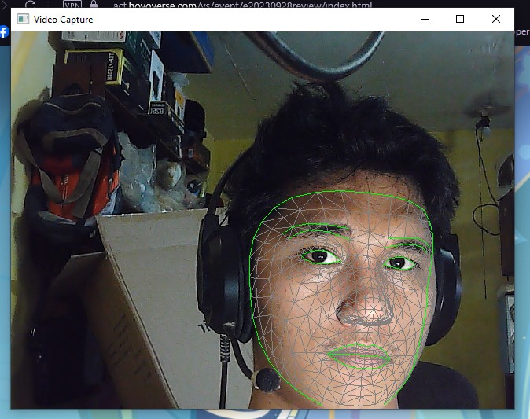

# FaceMesh Visualization (Detecting Face Features) with OpenCV and Mediapipe

## Overview

This Python script uses OpenCV and Mediapipe to find and show facial features in real-time. It uses your computer's camera to capture video, detects facial landmarks using the FaceMesh model from Mediapipe, and displays the found face details on the video.



## Credits

- [Video Tutorial by Coding Lane](https://www.youtube.com/watch?v=rAS17tDYeA0&t=641s)
- [GitHub Repository by Coding Lane](https://github.com/Coding-Lane/Facial-Landmark-Detection---Mediapipe)
- [ChatGPT by OpenAI](https://chat.openai.com)

## Prerequisites

- Python
- OpenCV (`cv2`)
- Mediapipe (`mediapipe`)

## Installation

1. **Install Python Libraries:**
   - Open PyCharm and go to your project.
   - Select `File` > `Settings` > `Project: Facial Landmark Detection` > `Python Interpreter`.
   - Add new packages by clicking the `+` button.
   - Type `opencv-python` and `mediapipe`, then click `Install Package`.

   ```bash
   pip install opencv-python mediapipe
   ```

## Description

- **Initialization:**
  - The script sets up tools and styles from Mediapipe.
  - It defines how to draw face features.

- **Camera Setup:**
  - Opens a connection to your computer's camera (usually the default one).

- **FaceMesh Model Initialization:**
  - Sets up the FaceMesh model with specific options.

- **Main Processing Loop:**
  - Continuously captures video frames from the camera.
  - Uses the FaceMesh model to analyze each frame.
  - If faces are found, it draws their features on the frame.

- **User Interaction:**
  - Displays the processed video.
  - Press 'q' to stop the program.

- **Cleanup:**
  - Closes the camera and windows when you finish using the program.


## Notes
- The program shows real-time face details on the video.
- Press 'q' to stop the program.
